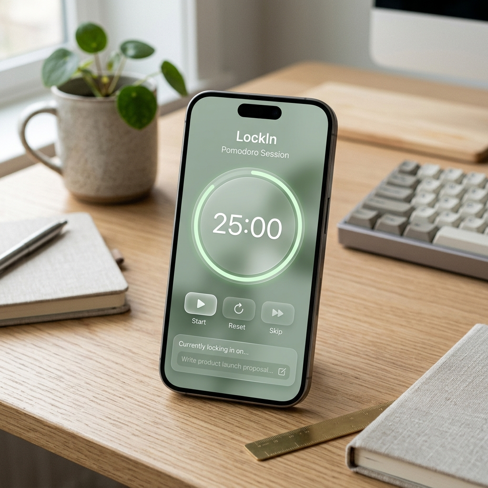

# 🌿 LockIn - Focus in Style

LockIn is a minimalist, aesthetic Pomodoro timer designed to help you stay productive while maintaining a calm, focused environment. Built with a modern **Sage & Glassmorphism** design system, it provides a seamless and distraction-free experience for your deep work sessions.



## ✨ Features

- **🎯 Aesthetic Pomodoro Timer**: Switch between Focus (25m), Short Break (5m), and Long Break (15m) modes.
- **✨ Glassmorphism UI**: A premium, semi-transparent design that feels light and modern.
- **🔄 Visual Progress**: A dynamic SVG progress ring that syncs with the timer's remaining time.
- **📝 Persistent Task Tracking**: Keep track of your current goal; your task is saved even if you refresh the page.
- **⚙️ Customizable Durations**: Tailor the session lengths to fit your personal workflow.
- **🔊 Gentle Audio Cues**: A soft chime notifies you when your session is complete.
- **🌓 Adaptive Themes**: The interface subtly adjusts its colors between focus and break modes.
- **⏱️ Dynamic Title**: The browser tab title always shows the remaining time.

## 🚀 Tech Stack

- **Core**: HTML5, TypeScript
- **Styling**: Vanilla CSS (Custom Glassmorphism system)
- **Build Tool**: [Vite](https://vitejs.dev/)
- **Icons**: [Lucide Icons](https://lucide.dev/)

## 🛠️ Quick Start

### Prerequisites

- [Node.js](https://nodejs.org/) (v18 or higher recommended)
- [npm](https://www.npmjs.com/)

### Installation

1. Clone the repository:
   ```bash
   git clone https://github.com/your-username/lockin-pomodoro.git
   cd lockin-pomodoro
   ```

2. Install dependencies:
   ```bash
   npm install
   ```

3. Start the development server:
   ```bash
   npm run dev
   ```

4. Build for production:
   ```bash
   npm run build
   ```

## 📂 Project Structure

```text
├── src/
│   ├── ts/
│   │   ├── main.ts        # UI Logic & DOM management
│   │   ├── timer.ts       # Core Timer Class
│   │   └── taskManager.ts # Persistence logic
│   ├── styles/
│   │   └── main.css       # Design system & glassmorphism
│   └── assets/            # Static assets
├── index.html             # Application entry point
└── tsconfig.json          # TypeScript configuration
```

## 📜 License

Distributed under the MIT License. See `LICENSE` for more information.

---

*Stay focused, stay calm, and LockIn.*
